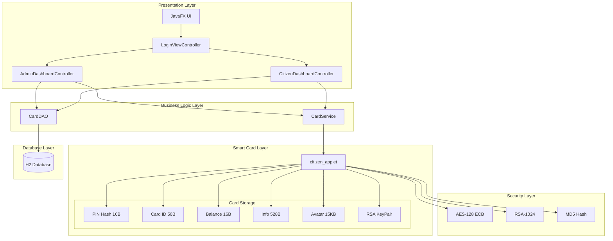
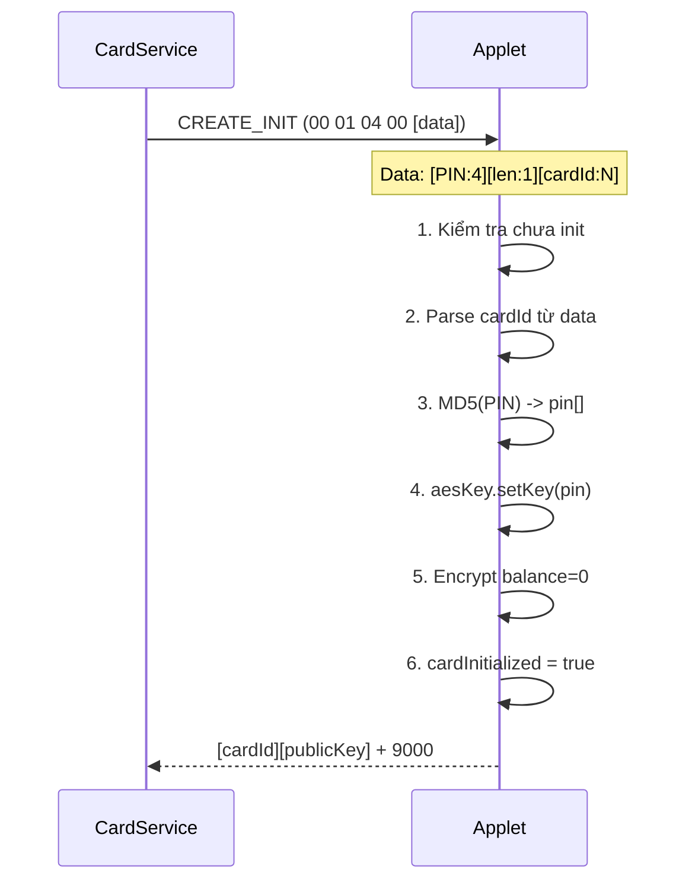
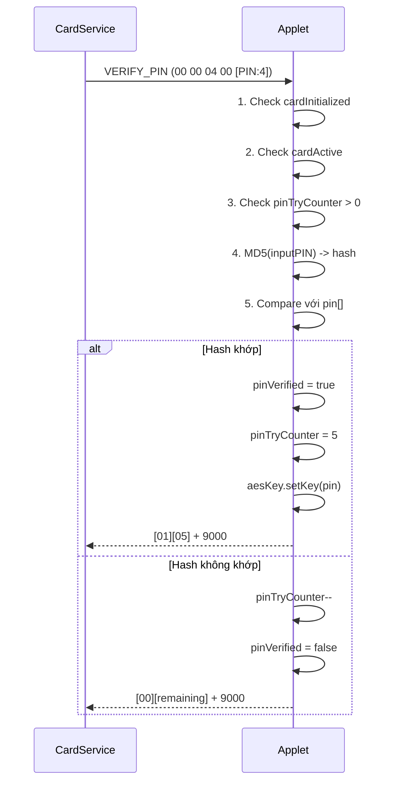
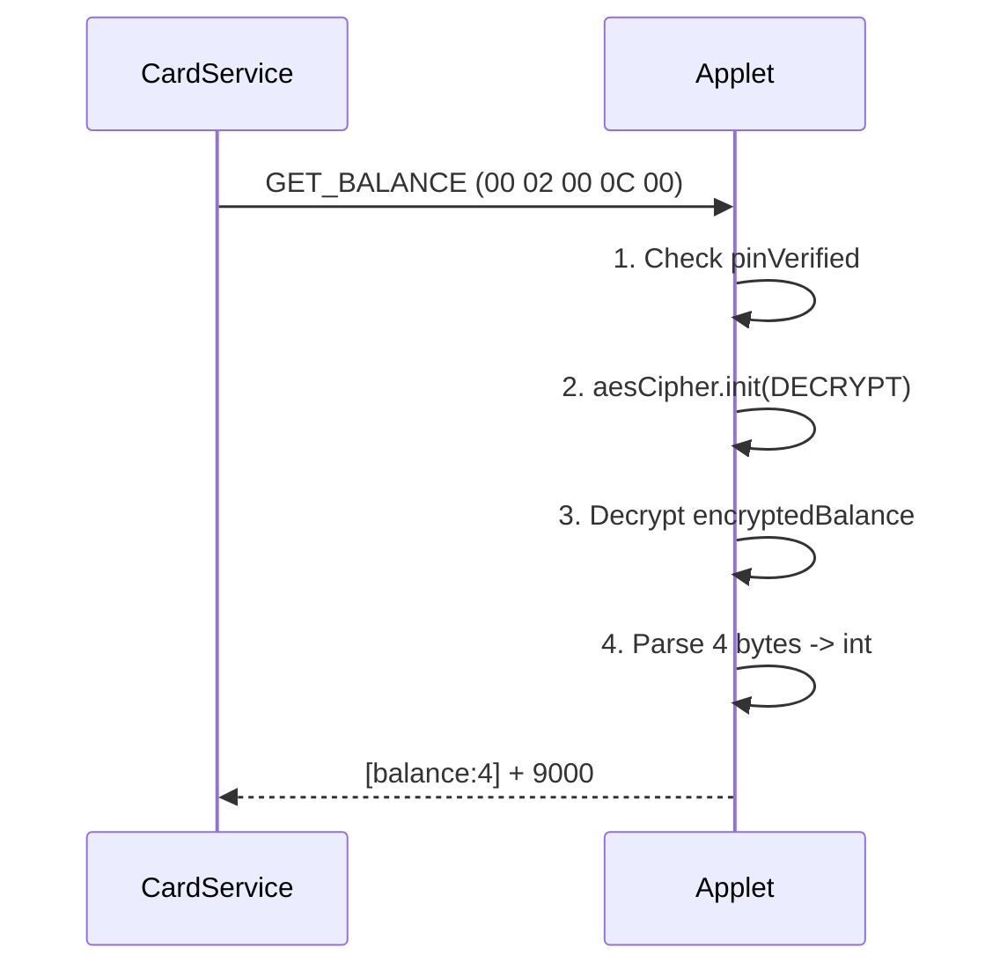
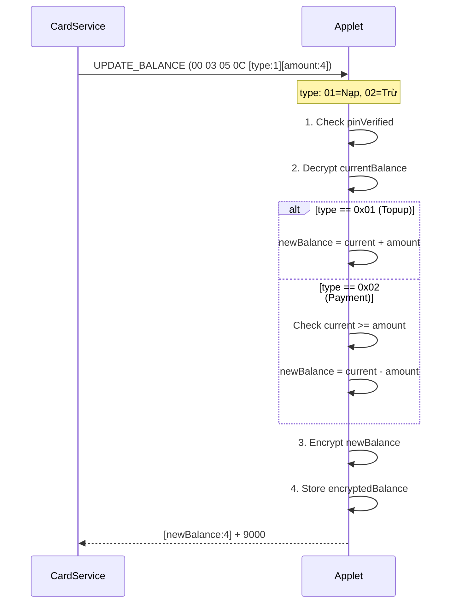
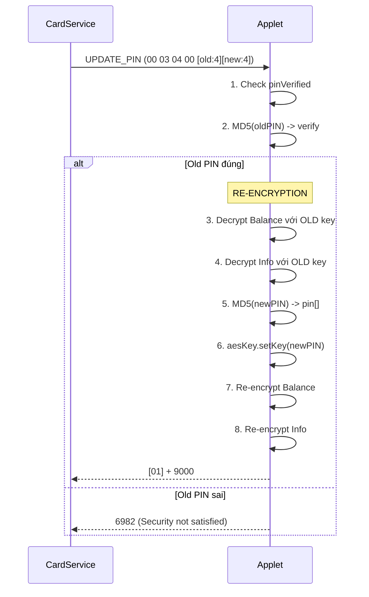
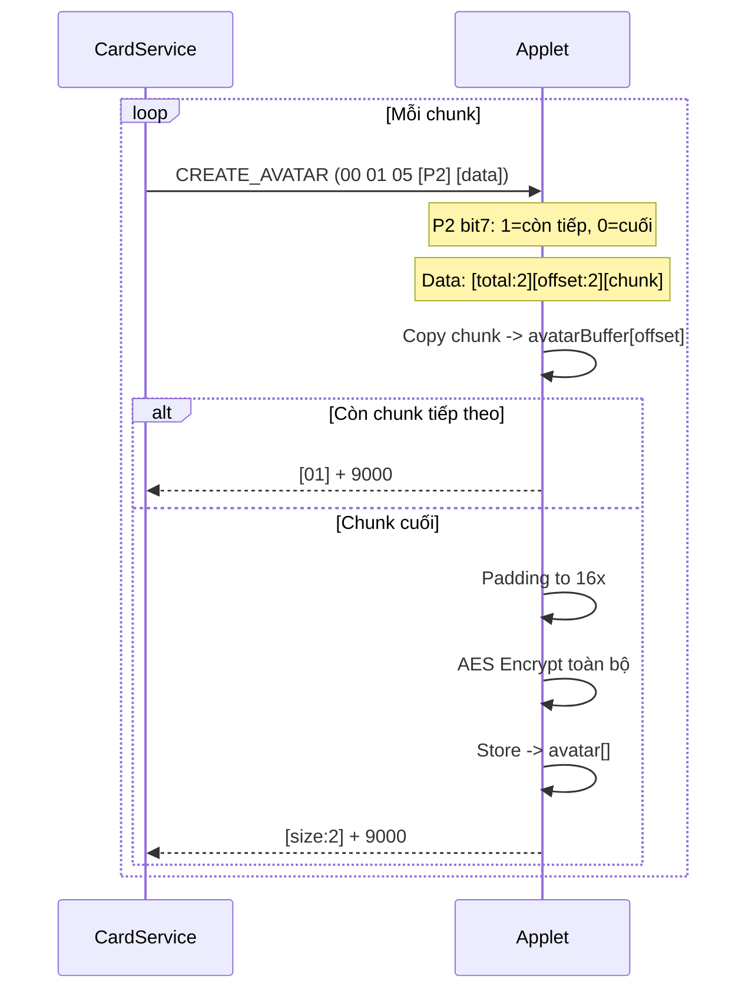
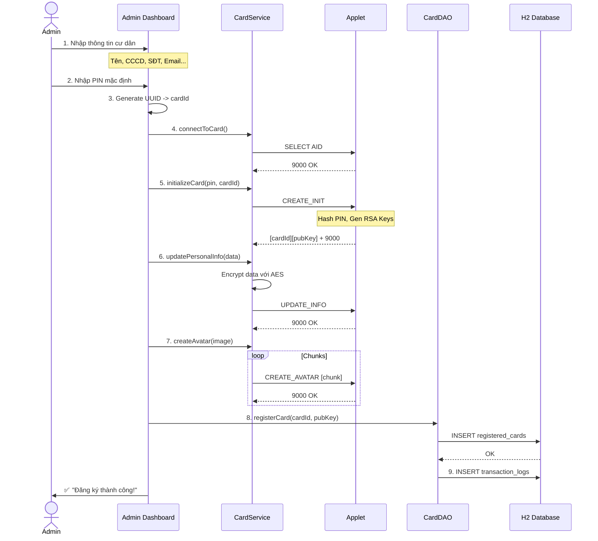
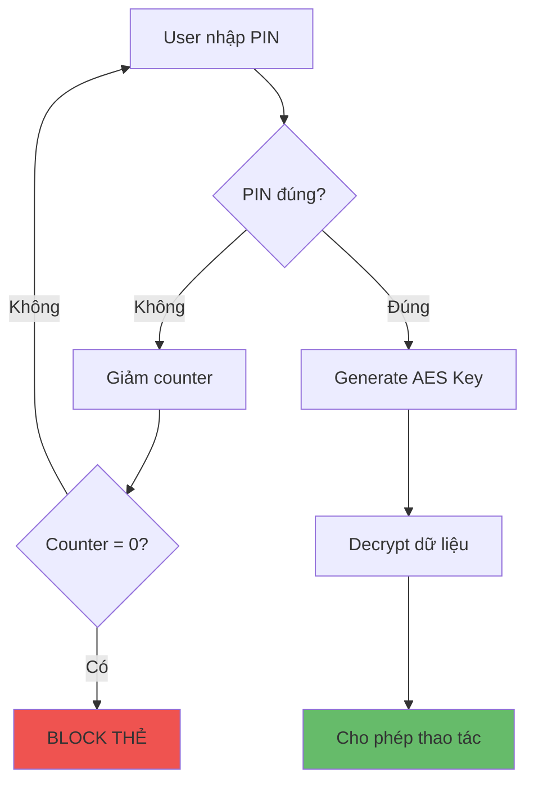

# 📋 Phân Tích Chi Tiết Bankcard Applet (CitizenCard)

## 1. Cấu Trúc Files

```
citizen_card/
├── applet/
│   └── src/citizen_applet/
│       └── citizen_applet.java     # 866 dòng - Logic JavaCard
│
├── desktop/
│   └── src/main/java/citizencard/
│       ├── MainApp.java            # Entry point JavaFX
│       ├── controller/
│       │   ├── LoginViewController.java        # 671 dòng
│       │   ├── AdminDashboardController.java   # 1615 dòng
│       │   ├── CitizenDashboardController.java # 1848 dòng
│       │   └── DemoWorkflowController.java
│       ├── dao/
│       │   └── CardDAO.java        # 631 dòng - H2 Database
│       ├── service/
│       │   └── CardService.java    # 1007 dòng - APDU
│       └── util/
│           ├── RSAUtils.java       # Xác thực chữ ký
│           ├── PinInputDialog.java # Dialog nhập PIN
│           └── DataValidator.java  # Validate dữ liệu
│
└── data/
    └── citizen_card.mv.db          # File H2 Database
```

---

## 2. Sơ Đồ Kiến Trúc Tổng Thể



---

## 3. Dữ Liệu Lưu Trữ Trên Thẻ

### 3.1 Bảng Chi Tiết Bộ Nhớ

| Biến | Kiểu | Kích thước | Mã hóa | Mô tả |
|------|------|-----------|--------|-------|
| `pin` | byte[] | 16 bytes | MD5 Hash | Hash của PIN 4 số |
| `cardId` | byte[] | 50 bytes | Không | ID định danh thẻ |
| `cardIdLength` | short | 2 bytes | Không | Độ dài thực của ID |
| `encryptedBalance` | byte[] | 16 bytes | AES-128 | Số dư (4 bytes int + padding) |
| `encryptedInfo` | byte[] | 528 bytes | AES-128 | Thông tin cá nhân |
| `avatar` | byte[] | 15,376 bytes | AES-128 | Ảnh đại diện |
| `rsaPrivateKey` | RSAPrivateKey | 1024 bit | Hardware | Khóa ký số |
| `rsaPublicKey` | RSAPublicKey | 1024 bit | Không | Khóa công khai |

### 3.2 Các Cờ Trạng Thái

| Biến | Kiểu | Mô tả |
|------|------|-------|
| `pinTryCounter` | byte | Số lần thử PIN còn lại (Max: 5) |
| `pinVerified` | boolean | PIN đã được xác thực trong session |
| `cardInitialized` | boolean | Thẻ đã được khởi tạo |
| `cardActive` | boolean | Thẻ đang hoạt động |

---

## 4. Cấu Trúc Thông Tin Công Dân

### 4.1 Format Dữ Liệu Info (JSON/Text)

```
[Họ tên]|[CCCD]|[Ngày sinh]|[Giới tính]|[Địa chỉ]|[SĐT]|[Email]
```

**Ví dụ:**
```
Nguyễn Văn A|012345678901|01/01/1990|Nam|123 Đường ABC, Quận 1, TP.HCM|0901234567|email@example.com
```

### 4.2 Quá Trình Mã Hóa Info


1. **Input**: Chuỗi thông tin (max 512 bytes)
2. **Padding**: Thêm `0x00` đến bội số của 16
3. **Encrypt**: AES-128 ECB với key từ PIN hash
4. **Store**: Lưu vào `encryptedInfo[]`

---

## 5. Danh Sách Lệnh APDU

### 5.1 Mã INS (Instruction)

| INS | Hex | Tên | Mô tả |
|-----|-----|-----|-------|
| INS_VERIFY | 0x00 | Xác thực | Verify PIN |
| INS_CREATE | 0x01 | Tạo mới | Init card, Avatar, Signature |
| INS_GET | 0x02 | Đọc | Lấy dữ liệu |
| INS_UPDATE | 0x03 | Cập nhật | Sửa PIN, Info, Balance |
| INS_RESET_TRY_PIN | 0x10 | Reset | Reset số lần thử PIN |
| INS_CLEAR_CARD | 0x11 | Xóa | Factory reset |

### 5.2 Mã P1 (Parameter 1 - Command Type)

| P1 | Hex | Tên | Dùng với INS |
|----|-----|-----|--------------|
| P1_PIN | 0x04 | PIN | CREATE, UPDATE |
| P1_CITIZEN_INFO | 0x05 | Info | CREATE, GET, UPDATE |
| P1_SIGNATURE | 0x06 | Ký số | CREATE |
| P1_FORGET_PIN | 0x0A | Quên PIN | UPDATE |
| P1_ACTIVATE_CARD | 0x0B | Kích hoạt | UPDATE |
| P1_DEACTIVATE_CARD | 0x0C | Vô hiệu | UPDATE |

### 5.3 Mã P2 (Parameter 2 - Data Type)

| P2 | Hex | Tên | Mô tả |
|----|-----|-----|-------|
| P2_INFORMATION | 0x07 | Thông tin | Personal info |
| P2_TRY_REMAINING | 0x08 | Số lần thử | PIN tries left |
| P2_AVATAR | 0x09 | Ảnh | Avatar data |
| P2_CARD_ID | 0x0A | ID thẻ | Card identifier |
| P2_PUBLIC_KEY | 0x0B | Khóa công khai | RSA public key |
| P2_BALANCE | 0x0C | Số dư | Wallet balance |

---

## 6. Luồng Chi Tiết Các Chức Năng

### 6.1 Khởi Tạo Thẻ (initializeCard)



### 6.2 Xác Thực PIN (verifyPin)



### 6.3 Đọc Số Dư (getBalance)



### 6.4 Cập Nhật Số Dư (updateBalance)



### 6.5 Đổi PIN (updatePin)



### 6.6 Upload Avatar (Chunked)



---

## 7. Chi Tiết Thuật Toán Mã Hóa

### 7.1 MD5 Hash (PIN)

```java
// Input: PIN 4 bytes ASCII ("1234")
// Output: 16 bytes hash

md5.reset();
md5.doFinal(buffer, offset, 4, pin, 0);

// Ví dụ: "1234" -> 81dc9bdb52d04dc20036dbd8313ed055
```

### 7.2 AES-128 ECB

```java
// Key: 16 bytes từ MD5(PIN)
// Mode: ECB (Electronic Codebook) - No IV

// Encrypt
aesKey.setKey(pin, 0);  // pin = MD5 hash
aesCipher.init(aesKey, Cipher.MODE_ENCRYPT);
aesCipher.doFinal(plaintext, 0, len, ciphertext, 0);

// Decrypt
aesCipher.init(aesKey, Cipher.MODE_DECRYPT);
aesCipher.doFinal(ciphertext, 0, len, plaintext, 0);
```

### 7.3 RSA-1024 Digital Signature

```java
// Ký số với Private Key
rsaSignature.init(rsaPrivateKey, Signature.MODE_SIGN);
short sigLen = rsaSignature.sign(data, 0, len, signature, 0);

// Output: 128 bytes signature
```

### 7.4 Serialize Public Key

```
Format: [expLen:2][exponent:3][modLen:2][modulus:128]
Total: 2 + 3 + 2 + 128 = 135 bytes
```

---

## 8. Bảng Tổng Hợp APDU Commands

| Chức năng | CLA | INS | P1 | P2 | Lc | Data | Le |
|-----------|-----|-----|----|----|----|----|-----|
| **VERIFY_PIN** | 00 | 00 | 04 | 00 | 04 | [PIN:4] | 02 |
| **CREATE_INIT** | 00 | 01 | 04 | 00 | N | [PIN:4][len:1][ID:N] | 00 |
| **CREATE_AVATAR** | 00 | 01 | 05 | xx | N | [total:2][off:2][data] | 00 |
| **CREATE_SIG** | 00 | 01 | 06 | 00 | N | [challenge] | 00 |
| **GET_CARD_ID** | 00 | 02 | 00 | 0A | 00 | - | 00 |
| **GET_PUB_KEY** | 00 | 02 | 00 | 0B | 00 | - | 00 |
| **GET_BALANCE** | 00 | 02 | 00 | 0C | 00 | - | 04 |
| **GET_TRY_REMAIN** | 00 | 02 | 00 | 08 | 00 | - | 01 |
| **GET_INFO** | 00 | 02 | 05 | 07 | 00 | - | 00 |
| **GET_AVATAR** | 00 | 02 | 05 | 09 | 00 | - | 00 |
| **UPDATE_PIN** | 00 | 03 | 04 | 00 | 08 | [old:4][new:4] | 01 |
| **UPDATE_INFO** | 00 | 03 | 05 | 07 | N | [encrypted data] | 01 |
| **UPDATE_BAL** | 00 | 03 | 05 | 0C | 05 | [type:1][amt:4] | 04 |
| **FORGET_PIN** | 00 | 03 | 0A | 00 | 04 | [newPIN:4] | 01 |
| **ACTIVATE** | 00 | 03 | 0B | 00 | 00 | - | 01 |
| **DEACTIVATE** | 00 | 03 | 0C | 00 | 00 | - | 01 |
| **RESET_TRIES** | 00 | 10 | 00 | 00 | 00 | - | 01 |
| **CLEAR_CARD** | 00 | 11 | 00 | 00 | 00 | - | 01 |

---

## 9. Luồng Hoàn Chỉnh: Đăng Ký Công Dân Mới



---

## 10. Lưu Trữ Trong Database

### 10.1 Bảng registered_cards

```sql
CREATE TABLE registered_cards (
    id INTEGER PRIMARY KEY AUTO_INCREMENT,
    card_id TEXT UNIQUE NOT NULL,     -- UUID từ Desktop
    public_key TEXT NOT NULL,          -- RSA Public Key (Base64)
    card_status TEXT DEFAULT 'ACTIVE', -- ACTIVE, BLOCKED, EXPIRED
    registered_at DATETIME,
    last_accessed DATETIME
);
```

### 10.2 Bảng invoices

```sql
CREATE TABLE invoices (
    id INTEGER PRIMARY KEY AUTO_INCREMENT,
    card_id TEXT NOT NULL,
    amount BIGINT NOT NULL,
    description TEXT,
    status TEXT DEFAULT 'PENDING',   -- PENDING, PAID, CANCELLED
    created_at DATETIME
);
```

### 10.3 Bảng topup_requests

```sql
CREATE TABLE topup_requests (
    id INTEGER PRIMARY KEY AUTO_INCREMENT,
    card_id TEXT NOT NULL,
    amount BIGINT NOT NULL,
    status TEXT DEFAULT 'PENDING',   -- PENDING, APPROVED, REJECTED, SYNCED
    created_at DATETIME,
    approved_at DATETIME
);
```

### 10.4 Bảng transaction_logs

```sql
CREATE TABLE transaction_logs (
    id INTEGER PRIMARY KEY AUTO_INCREMENT,
    card_id TEXT NOT NULL,
    operation_type TEXT NOT NULL,    -- LOGIN, TOPUP, PAYMENT, UPDATE_INFO, CHANGE_PIN
    amount INTEGER DEFAULT 0,
    timestamp DATETIME,
    success BOOLEAN,
    error_message TEXT
);
```

---

## 11. Các Điểm Bảo Mật Quan Trọng

### 11.1 Bảo Vệ PIN

| Cơ chế | Mô tả |
|--------|-------|
| **Hash MD5** | PIN không bao giờ lưu dạng plain text |
| **Giới hạn thử** | Tối đa 5 lần sai -> Block thẻ |
| **Session-based** | PIN chỉ valid trong session hiện tại |
| **Re-encrypt on change** | Đổi PIN = Re-encrypt toàn bộ dữ liệu |

### 11.2 Bảo Vệ Dữ Liệu

| Cơ chế | Mô tả |
|--------|-------|
| **AES-128** | Tất cả dữ liệu nhạy cảm được mã hóa |
| **Key từ PIN** | Không có PIN = Không có Key |
| **Không lưu DB** | Thông tin cá nhân chỉ ở trên thẻ |

### 11.3 Xác Thực Thẻ

| Cơ chế | Mô tả |
|--------|-------|
| **RSA-1024** | Mỗi thẻ có cặp key riêng |
| **Challenge-Response** | Server gửi challenge, thẻ ký trả về |
| **Private Key bảo vệ** | Không bao giờ export ra ngoài |

### 11.4 Luồng Bảo Mật



---

## 12. Thứ Tự Thực Hiện Các Chức Năng

### 12.1 Workflow Phát Hành Thẻ

```
1. SELECT APPLET         -> Kết nối
2. CREATE_INIT           -> Khởi tạo (PIN + ID + RSA)
3. UPDATE_INFO           -> Lưu thông tin cá nhân
4. CREATE_AVATAR         -> Upload ảnh (chunked)
5. DB: registerCard()    -> Đăng ký vào hệ thống
```

### 12.2 Workflow Đăng Nhập Cư Dân

```
1. SELECT APPLET         -> Kết nối
2. GET_CARD_ID           -> Lấy ID xác định thẻ
3. DB: isRegistered()    -> Kiểm tra hợp lệ
4. VERIFY_PIN            -> Xác thực người dùng
5. GET_BALANCE           -> Load số dư
6. GET_INFO              -> Load thông tin cá nhân
7. Sync Topups           -> Đồng bộ nạp tiền chờ
```

### 12.3 Workflow Thanh Toán

```
1. VERIFY_PIN            -> Xác thực (nếu chưa)
2. GET_BALANCE           -> Kiểm tra số dư
3. UPDATE_BALANCE (02)   -> Trừ tiền
4. DB: payInvoice()      -> Cập nhật hóa đơn -> PAID
5. DB: logTransaction()  -> Ghi log
```

### 12.4 Workflow Nạp Tiền

```
-- Bước 1: Cư dân tạo yêu cầu --
1. DB: createTopupRequest() -> PENDING

-- Bước 2: Admin duyệt --
2. DB: approveTopupRequest() -> APPROVED

-- Bước 3: Cư dân đăng nhập --
3. DB: getApprovedTopups()
4. VERIFY_PIN
5. UPDATE_BALANCE (01)    -> Cộng tiền
6. DB: markAsSynced()     -> SYNCED
```

---

## Phụ Lục: Status Words (SW)

| SW | Mô tả |
|----|-------|
| 9000 | Thành công |
| 6300 | Xác thực thất bại |
| 6982 | Security status not satisfied |
| 6983 | Authentication blocked |
| 6985 | Conditions not satisfied |
| 6A80 | Incorrect data |
| 6A86 | Incorrect P1/P2 |
| 6D00 | INS not supported |
| 6F00 | Unknown error |
