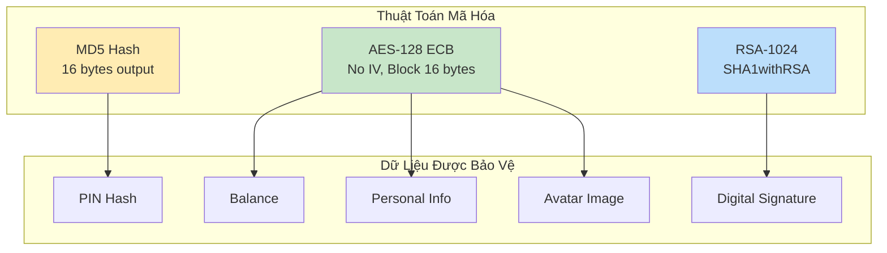
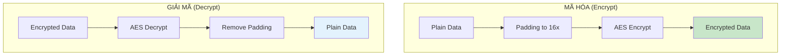
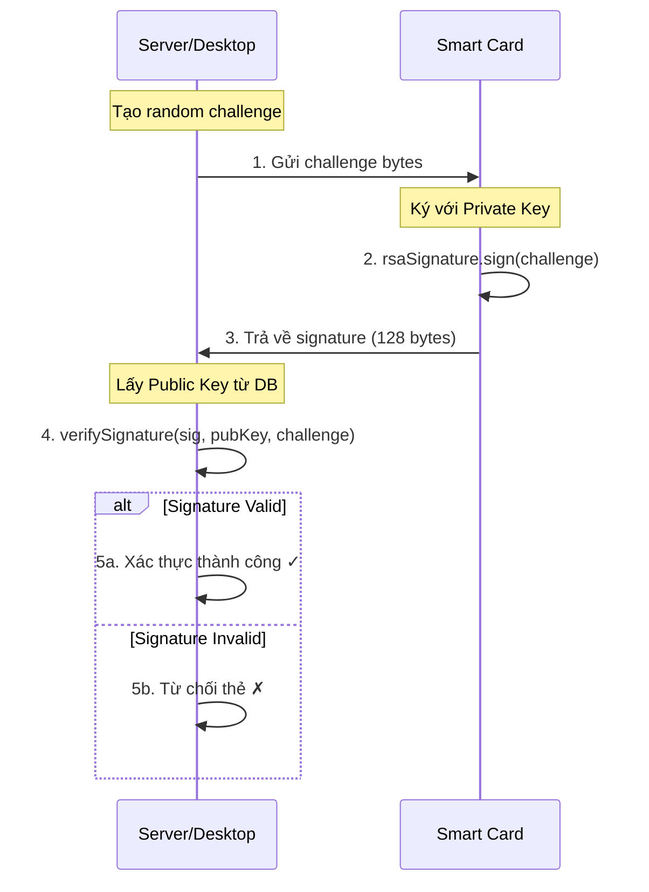
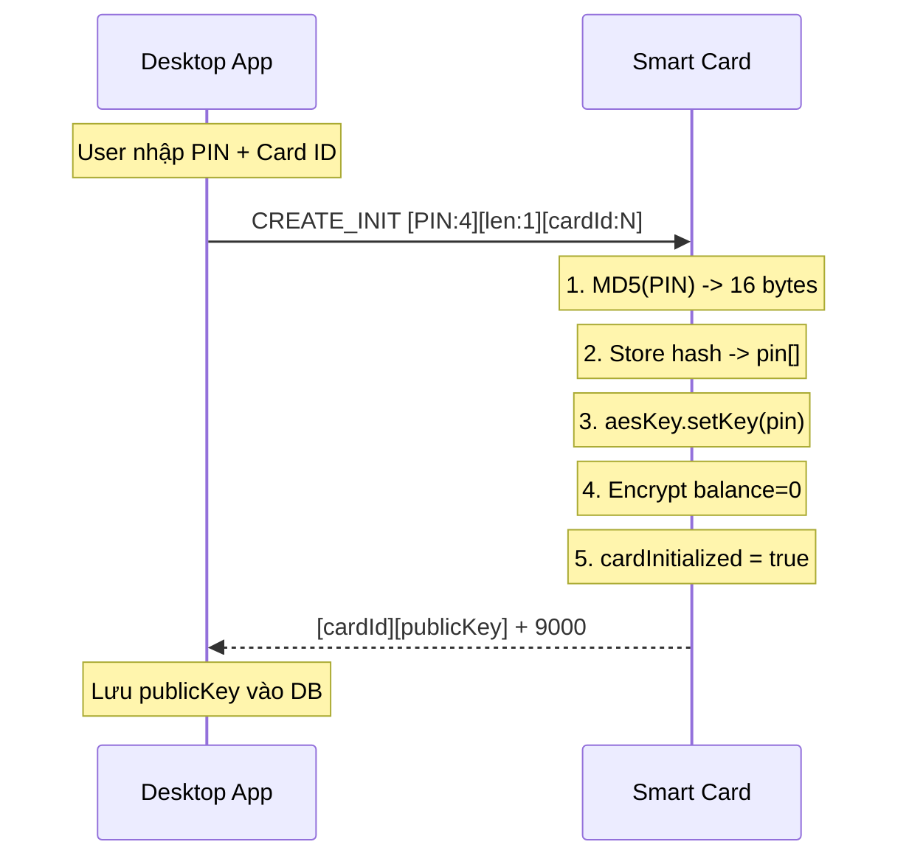
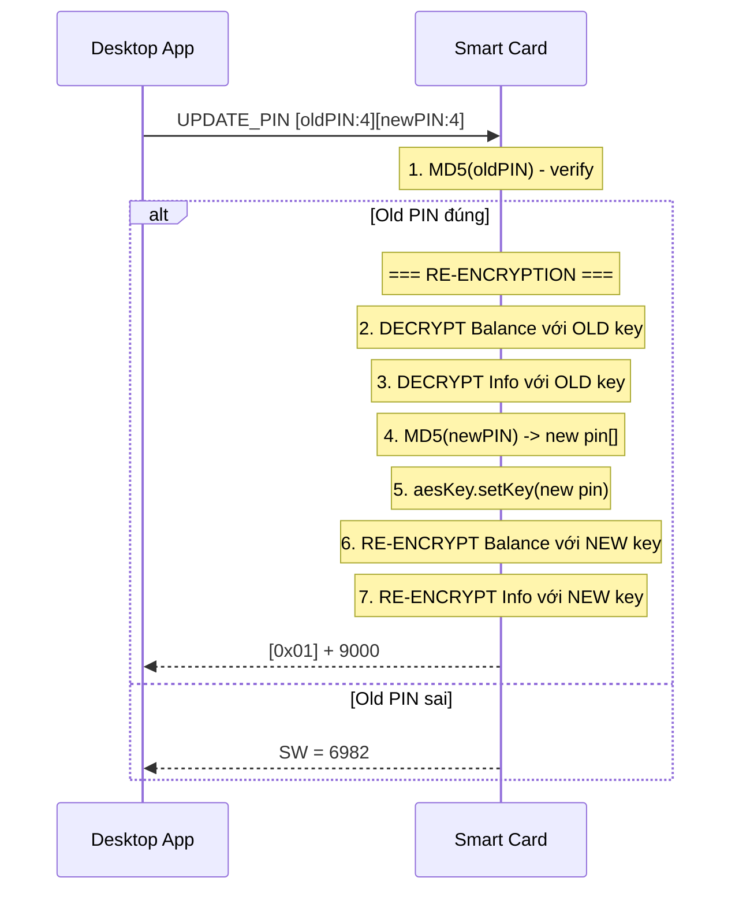
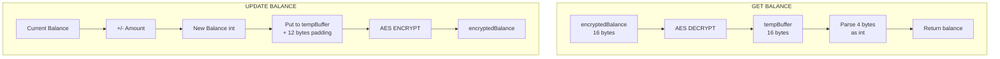
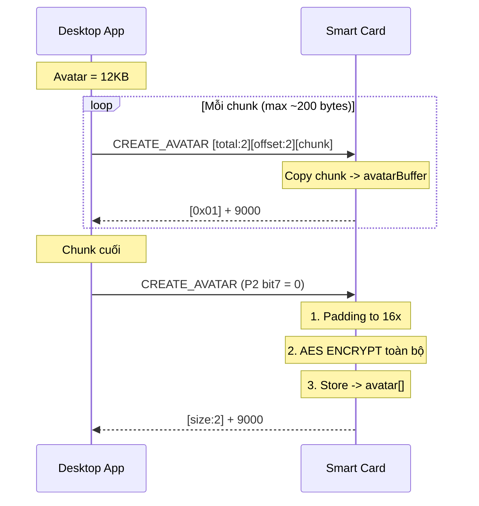
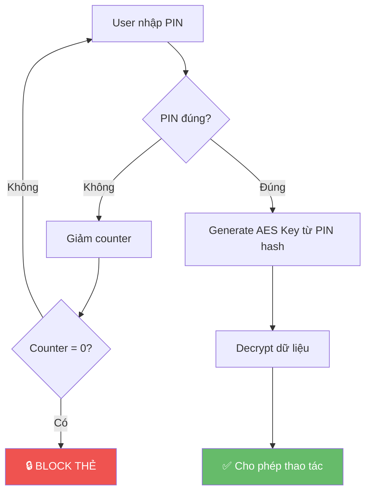

# 🔐 Tài Liệu Chi Tiết: Mã Hóa và Giải Mã trong Citizen Card

## Mục Lục
1. [Tổng Quan Kiến Trúc Bảo Mật](#1-tổng-quan-kiến-trúc-bảo-mật)
2. [MD5 Hash - Xử Lý PIN](#2-md5-hash---xử-lý-pin)
3. [AES-128 ECB - Mã Hóa Dữ Liệu](#3-aes-128-ecb---mã-hóa-dữ-liệu)
4. [RSA-1024 - Chữ Ký Số](#4-rsa-1024---chữ-ký-số)
5. [Luồng Xử Lý Chi Tiết](#5-luồng-xử-lý-chi-tiết)
6. [Các Điểm Bảo Mật Quan Trọng](#6-các-điểm-bảo-mật-quan-trọng)

---

## 1. Tổng Quan Kiến Trúc Bảo Mật

### 1.1 Sơ Đồ Tổng Thể



### 1.2 Bảng Tóm Tắt Các Phương Thức Mã Hóa

| Thành phần | Thuật toán | Kích thước Key | Mục đích |
|------------|------------|----------------|----------|
| **PIN** | MD5 | 128 bit (16 bytes) | Hash PIN để lưu trữ an toàn |
| **Balance** | AES-128 ECB | 128 bit (từ MD5 PIN) | Mã hóa số dư |
| **Info** | AES-128 ECB | 128 bit (từ MD5 PIN) | Mã hóa thông tin cá nhân |
| **Avatar** | AES-128 ECB | 128 bit (từ MD5 PIN) | Mã hóa ảnh đại diện |
| **Signature** | RSA-1024 SHA1 | 1024 bit | Chữ ký xác thực thẻ |

---

## 2. MD5 Hash - Xử Lý PIN

### 2.1 Mục Đích

- **Không lưu PIN dạng plain text**: PIN được hash trước khi lưu
- **Tạo AES key**: MD5 hash của PIN được dùng làm AES key

### 2.2 Cơ Chế Hoạt Động

```mermaid
graph LR
    A[PIN 4 số<br/>VD: 1234] --> B[MD5 Hash]
    B --> C[16 bytes output<br/>81dc9bdb52d04dc20036dbd8313ed055]
    C --> D[pin[] array]
    C --> E[AES Key]
    
    style A fill:#ffcdd2
    style C fill:#c8e6c9
```

### 2.3 Code Implementation (Applet)

```java
// File: citizen_applet.java

// Khởi tạo MD5
private MessageDigest md5;
md5 = MessageDigest.getInstance(MessageDigest.ALG_MD5, false);

// Hash PIN khi khởi tạo thẻ
private void initializeCard(APDU apdu) {
    byte[] buffer = apdu.getBuffer();
    
    // Hash PIN với MD5 (4 bytes input -> 16 bytes output)
    md5.reset();
    md5.doFinal(buffer, ISO7816.OFFSET_CDATA, PIN_LENGTH, pin, (short) 0);
    
    // Tạo AES key từ PIN hash
    aesKey.setKey(pin, (short) 0);
}
```

### 2.4 Xác Thực PIN

```java
// File: citizen_applet.java - verifyPin()

private void verifyPin(APDU apdu) {
    byte[] buffer = apdu.getBuffer();
    
    // 1. Hash PIN nhập vào
    md5.reset();
    md5.doFinal(buffer, ISO7816.OFFSET_CDATA, PIN_LENGTH, tempBuffer, (short) 0);
    
    // 2. So sánh với PIN đã lưu
    if (Util.arrayCompare(pin, (short) 0, tempBuffer, (short) 0, (short) 16) == 0) {
        // PIN đúng
        pinVerified = true;
        pinTryCounter = MAX_PIN_TRIES;  // Reset counter
        
        // 3. Regenerate AES key từ PIN hash
        aesKey.setKey(pin, (short) 0);
    } else {
        // PIN sai
        pinTryCounter--;
        pinVerified = false;
    }
}
```

### 2.5 Ví Dụ Cụ Thể

| Input PIN | MD5 Hash (Hex) |
|-----------|----------------|
| `1234` | `81dc9bdb52d04dc20036dbd8313ed055` |
| `0000` | `4a7d1ed414474e4033ac29ccb8653d9b` |
| `9999` | `1f9dedc7d0ad8f3f15a45a4a1e3e68cf` |

---

## 3. AES-128 ECB - Mã Hóa Dữ Liệu

### 3.1 Đặc Điểm Kỹ Thuật

| Thuộc tính | Giá trị |
|------------|---------|
| **Thuật toán** | AES (Advanced Encryption Standard) |
| **Mode** | ECB (Electronic Codebook) |
| **Key Size** | 128 bit (16 bytes) |
| **Block Size** | 16 bytes |
| **Padding** | Zero-padding (0x00) |
| **IV** | Không sử dụng (ECB mode) |

### 3.2 Quy Trình Mã Hóa



### 3.3 Code Implementation

#### 3.3.1 Khởi Tạo AES

```java
// File: citizen_applet.java - Constructor

// Tạo AES Key object (chưa có giá trị)
private AESKey aesKey;
private Cipher aesCipher;

aesKey = (AESKey) KeyBuilder.buildKey(
    KeyBuilder.TYPE_AES, 
    KeyBuilder.LENGTH_AES_128, 
    false
);

// Tạo Cipher (ALG_AES_BLOCK_128_ECB_NOPAD = không tự padding)
aesCipher = Cipher.getInstance(
    Cipher.ALG_AES_BLOCK_128_ECB_NOPAD, 
    false
);
```

#### 3.3.2 Mã Hóa Balance

```java
// File: citizen_applet.java - updateBalance()

private void updateBalance(APDU apdu) {
    // 1. GIẢI MÃ số dư hiện tại
    aesCipher.init(aesKey, Cipher.MODE_DECRYPT);
    aesCipher.doFinal(encryptedBalance, (short) 0, (short) 16, tempBuffer, (short) 0);
    int currentBalance = getInt(tempBuffer, (short) 0);
    
    // 2. Tính toán số dư mới
    int newBalance;
    if (type == 0x01) { // Topup
        newBalance = currentBalance + amount;
    } else if (type == 0x02) { // Payment
        newBalance = currentBalance - amount;
    }
    
    // 3. MÃ HÓA số dư mới
    putInt(tempBuffer, (short) 0, newBalance);
    Util.arrayFillNonAtomic(tempBuffer, (short) 4, (short) 12, (byte) 0x00);  // Padding
    
    aesCipher.init(aesKey, Cipher.MODE_ENCRYPT);
    aesCipher.doFinal(tempBuffer, (short) 0, (short) 16, encryptedBalance, (short) 0);
}
```

#### 3.3.3 Mã Hóa Thông Tin Cá Nhân

```java
// File: citizen_applet.java - updateInfo()

private void updateInfo(APDU apdu) {
    byte[] buffer = apdu.getBuffer();
    short lc = apdu.setIncomingAndReceive();  // Độ dài dữ liệu
    
    // 1. PADDING đến bội số của 16
    short paddedLen = (short) (lc + (16 - (lc % 16)));
    Util.arrayFillNonAtomic(
        buffer, 
        (short) (ISO7816.OFFSET_CDATA + lc), 
        (short) (paddedLen - lc), 
        (byte) 0x00
    );
    
    // 2. MÃ HÓA với AES
    aesCipher.init(aesKey, Cipher.MODE_ENCRYPT);
    aesCipher.doFinal(buffer, ISO7816.OFFSET_CDATA, paddedLen, encryptedInfo, (short) 0);
    encryptedInfoLength = paddedLen;
}

// GIẢI MÃ khi đọc
private void getInfo(APDU apdu) {
    byte[] buffer = apdu.getBuffer();
    
    // 1. GIẢI MÃ
    aesCipher.init(aesKey, Cipher.MODE_DECRYPT);
    short len = aesCipher.doFinal(encryptedInfo, (short) 0, encryptedInfoLength, buffer, (short) 0);
    
    // 2. REMOVE PADDING
    short actualLen = removePadding(buffer, len);
    apdu.setOutgoingAndSend((short) 0, actualLen);
}
```

#### 3.3.4 Mã Hóa Avatar

```java
// File: citizen_applet.java - createAvatar()

private void createAvatar(APDU apdu) {
    // Sau khi nhận đủ chunks...
    
    // 1. PADDING đến bội số của 16
    short paddedLen = (short) (totalLen + (16 - (totalLen % 16)));
    Util.arrayFillNonAtomic(avatarBuffer, totalLen, (short) (paddedLen - totalLen), (byte) 0x00);
    
    // 2. MÃ HÓA toàn bộ avatar
    aesCipher.init(aesKey, Cipher.MODE_ENCRYPT);
    aesCipher.doFinal(avatarBuffer, (short) 0, paddedLen, avatar, (short) 0);
    avatarSize = paddedLen;
}

// GIẢI MÃ khi đọc
private void getAvatar(APDU apdu) {
    // 1. GIẢI MÃ
    aesCipher.init(aesKey, Cipher.MODE_DECRYPT);
    aesCipher.doFinal(avatar, (short) 0, avatarSize, avatarBuffer, (short) 0);
    
    // 2. Tính độ dài thực (loại bỏ padding)
    short actualLen = getArrayLen(avatarBuffer, avatarSize);
    
    // 3. Gửi dữ liệu
    // ...
}
```

### 3.4 Ví Dụ Padding

```
Ví dụ: Dữ liệu gốc = 45 bytes

Tính padding:
- 45 % 16 = 13 (số byte dư)
- 16 - 13 = 3 (cần thêm 3 bytes)
- Padded length = 45 + 3 = 48 bytes

Kết quả:
[45 bytes data][0x00][0x00][0x00]
```

### 3.5 Cấu Trúc Dữ Liệu Mã Hóa

| Loại dữ liệu | Plain Size | Padded Size | Cấu trúc |
|--------------|------------|-------------|----------|
| **Balance** | 4 bytes | 16 bytes | `[int:4][padding:12]` |
| **Info** | Max 512 bytes | Max 528 bytes | `[data:N][padding:16-N%16]` |
| **Avatar** | Max 15,360 bytes | Max 15,376 bytes | `[image:N][padding:16-N%16]` |

---

## 4. RSA-1024 - Chữ Ký Số

### 4.1 Mục Đích

- **Xác thực thẻ**: Chứng minh thẻ là thật (không bị giả mạo)
- **Challenge-Response**: Server gửi challenge, thẻ ký và trả về

### 4.2 Đặc Điểm Kỹ Thuật

| Thuộc tính | Giá trị |
|------------|---------|
| **Thuật toán** | RSA |
| **Key Size** | 1024 bit |
| **Signature Algorithm** | SHA1withRSA (ALG_RSA_SHA_PKCS1) |
| **Output Size** | 128 bytes (1024/8) |
| **Private Key** | Lưu trên thẻ, không export |
| **Public Key** | Export được, lưu trong DB |

### 4.3 Quy Trình Challenge-Response



### 4.4 Code Implementation

#### 4.4.1 Tạo Cặp Khóa (Applet)

```java
// File: citizen_applet.java - Constructor

private RSAPrivateKey rsaPrivateKey;
private RSAPublicKey rsaPublicKey;
private Signature rsaSignature;
private byte[] signatureBuffer;

// Khởi tạo Signature object
rsaSignature = Signature.getInstance(Signature.ALG_RSA_SHA_PKCS1, false);
signatureBuffer = JCSystem.makeTransientByteArray(
    (short) (KeyBuilder.LENGTH_RSA_1024 / 8),  // 128 bytes
    JCSystem.CLEAR_ON_RESET
);

// Tạo cặp khóa RSA-1024
KeyPair rsaKeyPair = new KeyPair(KeyPair.ALG_RSA, KeyBuilder.LENGTH_RSA_1024);
rsaKeyPair.genKeyPair();

rsaPrivateKey = (RSAPrivateKey) rsaKeyPair.getPrivate();
rsaPublicKey = (RSAPublicKey) rsaKeyPair.getPublic();
```

#### 4.4.2 Ký Số (Applet)

```java
// File: citizen_applet.java - createSignature()

private void createSignature(APDU apdu) {
    if (!cardInitialized || !pinVerified) {
        ISOException.throwIt(ISO7816.SW_SECURITY_STATUS_NOT_SATISFIED);
    }
    
    byte[] buffer = apdu.getBuffer();
    short lc = apdu.setIncomingAndReceive();  // Challenge length
    
    // 1. Ký dữ liệu với Private Key
    rsaSignature.init(rsaPrivateKey, Signature.MODE_SIGN);
    short sigLen = rsaSignature.sign(
        buffer, ISO7816.OFFSET_CDATA,  // Challenge data
        lc,                             // Challenge length
        signatureBuffer, (short) 0      // Output buffer
    );
    
    // 2. Trả về signature (128 bytes)
    Util.arrayCopy(signatureBuffer, (short) 0, buffer, (short) 0, sigLen);
    apdu.setOutgoingAndSend((short) 0, sigLen);
}
```

#### 4.4.3 Serialize Public Key (Applet)

```java
// File: citizen_applet.java - serializePublicKey()

// Format: [expLen:2][exponent:3][modLen:2][modulus:128]
// Total: 2 + 3 + 2 + 128 = 135 bytes

private short serializePublicKey(byte[] buffer, short offset) {
    short pos = offset;
    
    // 1. Exponent length (2 bytes)
    short expLen = rsaPublicKey.getExponent(buffer, (short) (pos + 2));
    Util.setShort(buffer, pos, expLen);
    pos += (short) (2 + expLen);
    
    // 2. Modulus length (2 bytes)  
    short modLen = rsaPublicKey.getModulus(buffer, (short) (pos + 2));
    Util.setShort(buffer, pos, modLen);
    pos += (short) (2 + modLen);
    
    return (short) (pos - offset);  // Total length
}
```

#### 4.4.4 Xác Thực Signature (Desktop)

```java
// File: RSAUtils.java

public static PublicKey generatePublicKeyFromBytes(byte[] data) {
    // 1. Parse exponent length
    int expLen = ((data[0] & 0xFF) << 8) | (data[1] & 0xFF);
    
    // 2. Extract exponent bytes
    byte[] expBytes = new byte[expLen];
    System.arraycopy(data, 2, expBytes, 0, expLen);
    
    // 3. Parse modulus length
    int modOffset = 2 + expLen;
    int modLen = ((data[modOffset] & 0xFF) << 8) | (data[modOffset + 1] & 0xFF);
    
    // 4. Extract modulus bytes
    byte[] modBytes = new byte[modLen];
    System.arraycopy(data, modOffset + 2, modBytes, 0, modLen);
    
    // 5. Reconstruct Public Key
    BigInteger exponent = new BigInteger(1, expBytes);
    BigInteger modulus = new BigInteger(1, modBytes);
    
    RSAPublicKeySpec spec = new RSAPublicKeySpec(modulus, exponent);
    KeyFactory keyFactory = KeyFactory.getInstance("RSA");
    return keyFactory.generatePublic(spec);
}

public static boolean verifySignature(byte[] signature, PublicKey publicKey, byte[] challenge) {
    Signature verifier = Signature.getInstance("SHA1withRSA");
    verifier.initVerify(publicKey);
    verifier.update(challenge);
    return verifier.verify(signature);
}
```

---

## 5. Luồng Xử Lý Chi Tiết

### 5.1 Khởi Tạo Thẻ (Initialize Card)



**Code Flow:**
```
1. PIN "1234" -> MD5 -> 81dc9bdb52d04dc20036dbd8313ed055
2. pin[] = [0x81, 0xdc, 0x9b, ..., 0x55]
3. aesKey.setKey(pin) -> AES key sẵn sàng
4. tempBuffer = [0x00, 0x00, 0x00, 0x00, 0x00...]  // Balance = 0
5. AES_ENCRYPT(tempBuffer) -> encryptedBalance[]
```

### 5.2 Đổi PIN (Change PIN)



**Tại sao cần Re-encrypt?**

> AES key được tạo từ MD5(PIN). Khi đổi PIN:
> - Key cũ ≠ Key mới
> - Dữ liệu mã hóa bằng key cũ không thể giải mã bằng key mới
> - **Bắt buộc phải**: Decrypt với key cũ → Encrypt lại với key mới

### 5.3 Đọc/Ghi Số Dư



### 5.4 Upload/Download Avatar (Chunked)



---

## 6. Các Điểm Bảo Mật Quan Trọng

### 6.1 Bảo Vệ PIN

| Cơ chế | Chi tiết |
|--------|----------|
| **MD5 Hash** | PIN không bao giờ lưu dạng plain text |
| **Giới hạn thử** | Max 5 lần sai → Block thẻ |
| **Session-based** | `pinVerified` reset khi ngắt kết nối |
| **Re-encryption** | Đổi PIN = Re-encrypt toàn bộ dữ liệu |

### 6.2 Bảo Vệ Dữ Liệu

| Cơ chế | Chi tiết |
|--------|----------|
| **AES-128** | Tất cả dữ liệu nhạy cảm được mã hóa |
| **Key từ PIN** | Không có PIN = Không có AES Key |
| **Không lưu DB** | Thông tin cá nhân chỉ ở **trên thẻ** |
| **Encrypted at rest** | Dữ liệu trên thẻ luôn mã hóa |

### 6.3 Xác Thực Thẻ

| Cơ chế | Chi tiết |
|--------|----------|
| **RSA-1024** | Mỗi thẻ có cặp key riêng |
| **Private Key** | Không bao giờ export ra ngoài thẻ |
| **Challenge-Response** | Chống giả mạo thẻ |
| **Public Key in DB** | Dùng để verify signature |

### 6.4 Luồng Bảo Mật Tổng Hợp



---

## 7. Phụ Lục

### 7.1 Các File Liên Quan

| File | Mô tả |
|------|-------|
| `applet/src/citizen_applet/citizen_applet.java` | Logic mã hóa trên JavaCard |
| `desktop/src/main/java/citizencard/util/RSAUtils.java` | Xử lý RSA key và verify |
| `desktop/src/main/java/citizencard/service/CardService.java` | Giao tiếp APDU với thẻ |

### 7.2 Các Constant Quan Trọng

```java
// PIN Configuration
private static final byte PIN_LENGTH = 4;
private static final byte MAX_PIN_TRIES = 5;

// Data sizes
private static final short MAX_INFO_LENGTH = 512;
private static final short MAX_AVATAR_SIZE = 15360;  // 15KB

// Block size for AES
private static final short AES_BLOCK_SIZE = 16;

// RSA key size
// KeyBuilder.LENGTH_RSA_1024 = 1024 bits = 128 bytes
```

### 7.3 Status Words (SW)

| SW | Hex | Mô tả |
|----|-----|-------|
| SW_NO_ERROR | 9000 | Thành công |
| SW_WRONG_P1P2 | 6A86 | Tham số sai |
| SW_WRONG_LENGTH | 6700 | Độ dài dữ liệu sai |
| SW_SECURITY_STATUS_NOT_SATISFIED | 6982 | Chưa xác thực |
| SW_CONDITIONS_NOT_SATISFIED | 6985 | Điều kiện không đáp ứng |
| SW_INS_NOT_SUPPORTED | 6D00 | Lệnh không hỗ trợ |

---

> **Tài liệu này được tạo tự động từ mã nguồn dự án Citizen Card**
> 
> Ngày tạo: 2025-12-19
