# 📋 Citizen Card System - Tài liệu Luồng Hệ thống

## Tổng quan Kiến trúc

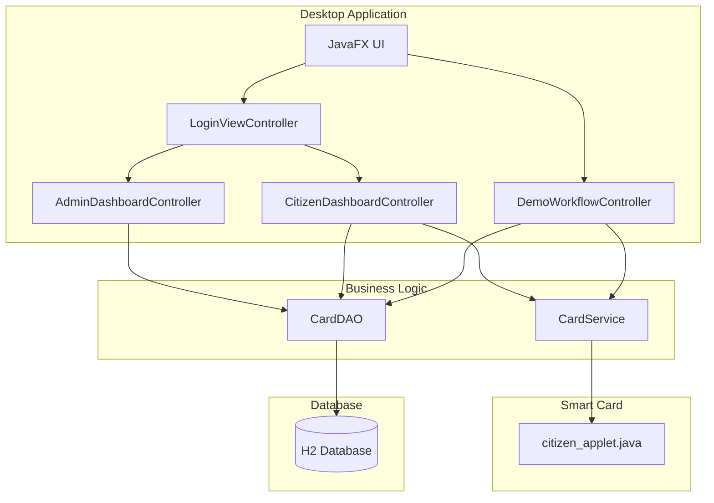

---

## 🔐 1. Luồng Đăng nhập (Authentication Flow)

### 1.1 Đăng nhập Admin
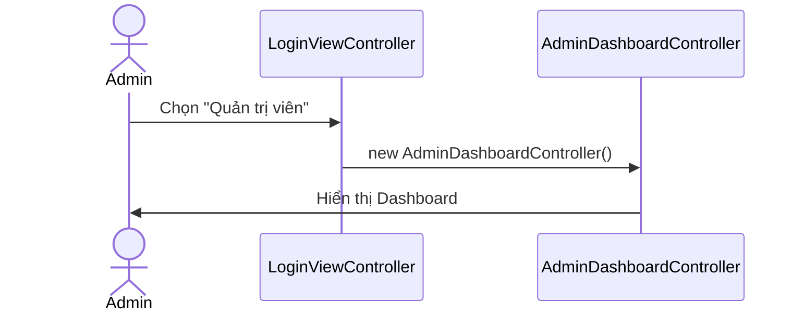

### 1.2 Đăng nhập Cư dân (PIN)
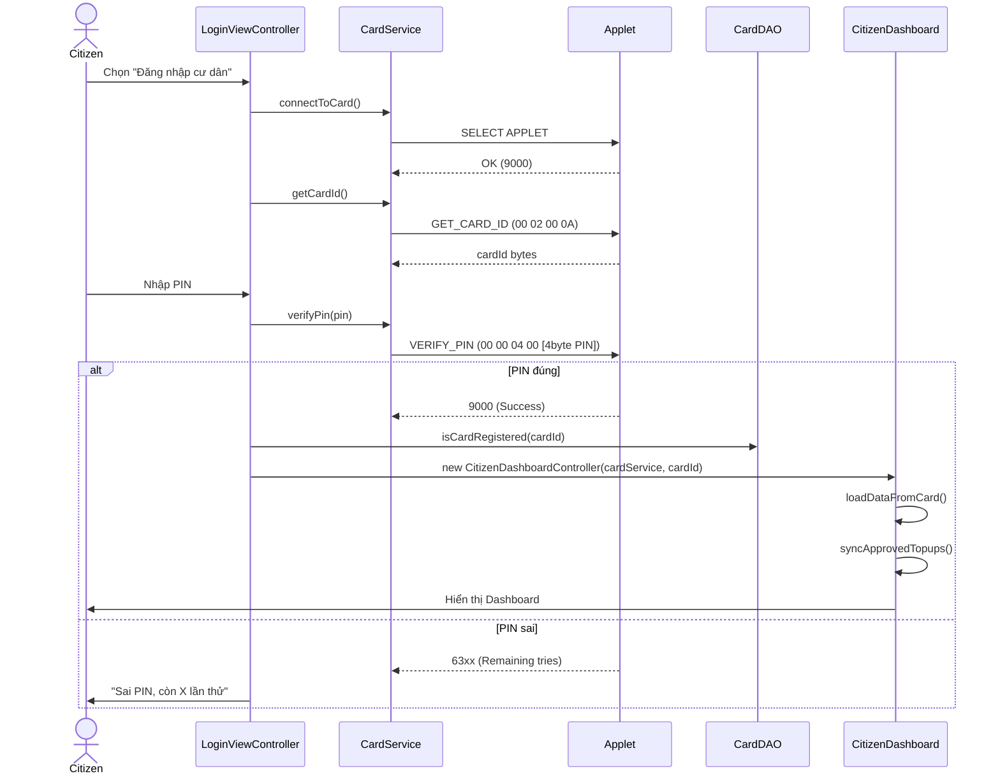

---

## 💳 2. Luồng Tạo Thẻ Mới

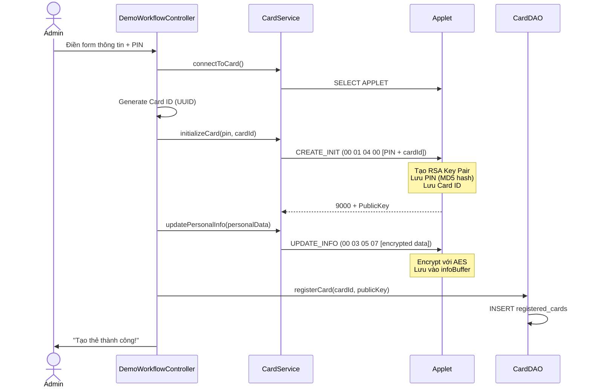

### Cấu trúc dữ liệu lưu trữ

| Vị trí | Dữ liệu | Mã hóa |
|--------|---------|--------|
| **Applet** | PIN, Card ID, RSA Keys, Personal Info, Avatar, Balance | AES-128 |
| **Database** | card_id, public_key, status, timestamps | Không |

---

## 📄 3. Luồng Hóa đơn (Invoice System)

### 3.1 Admin gửi hóa đơn
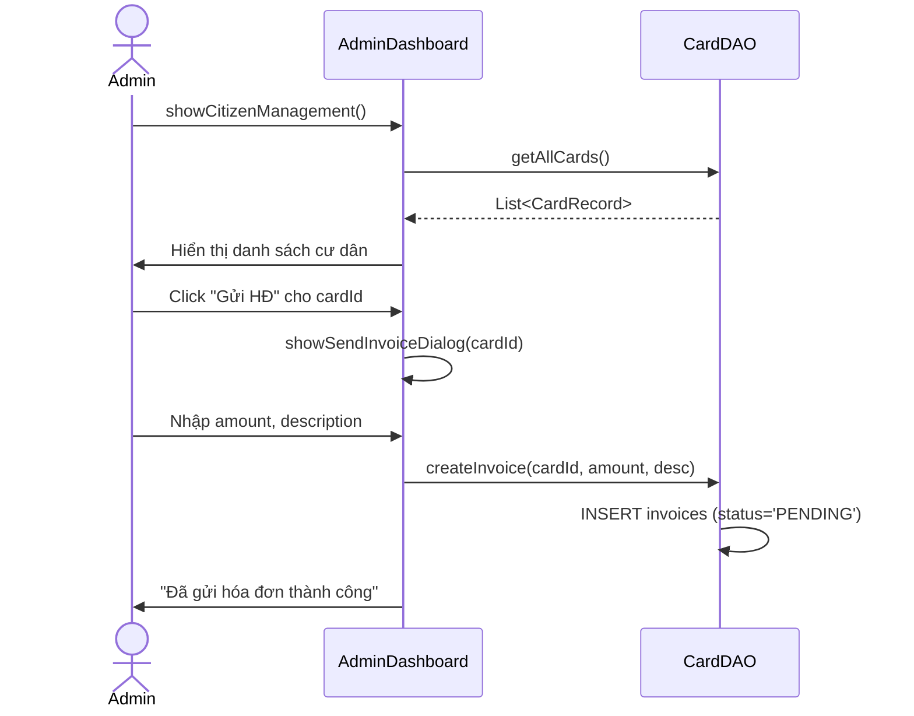

### 3.2 Cư dân thanh toán hóa đơn
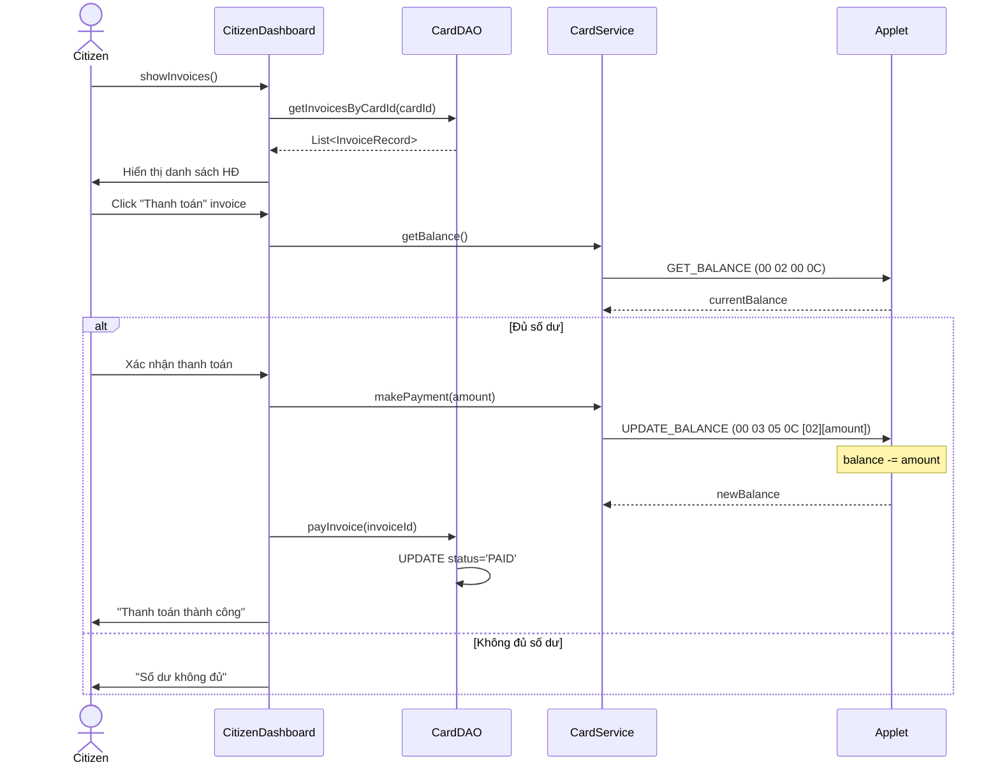

---

## 💰 4. Luồng Nạp tiền (Topup System)

### 4.1 Cư dân yêu cầu nạp tiền
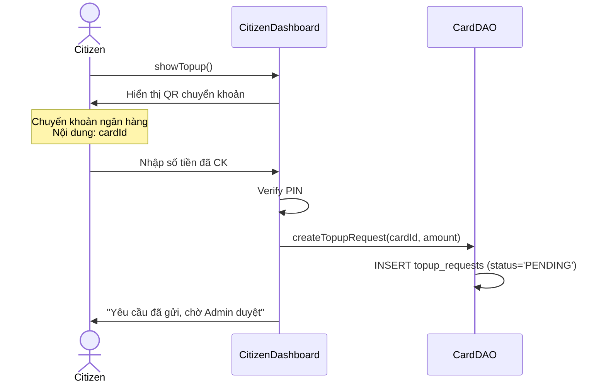

### 4.2 Admin duyệt yêu cầu
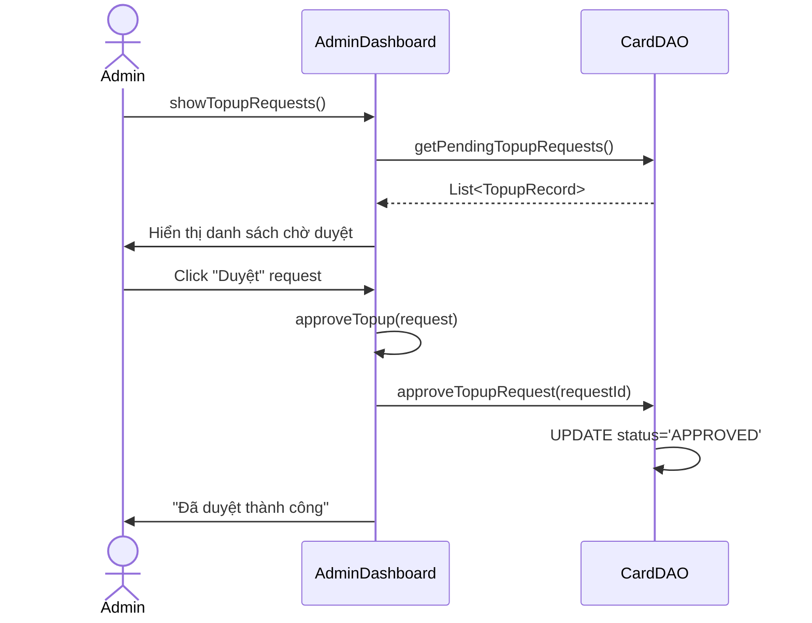

### 4.3 Đồng bộ số dư khi cư dân đăng nhập
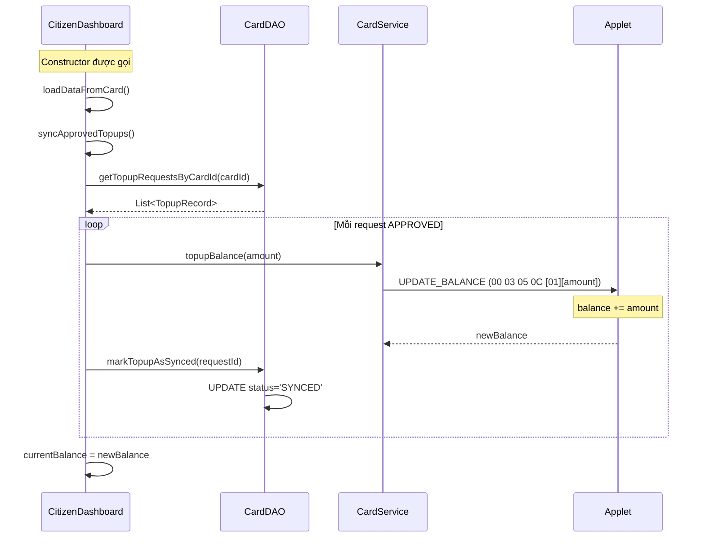

---

## ✏️ 5. Luồng Chỉnh sửa Thông tin

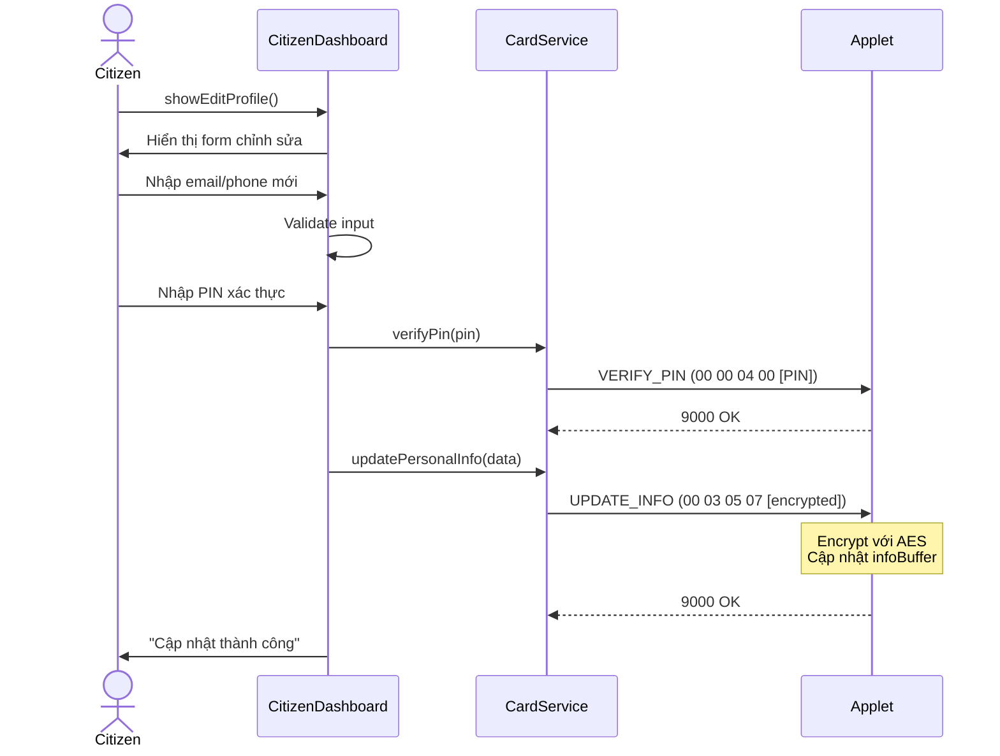

---

## 🔄 6. Luồng Đổi PIN

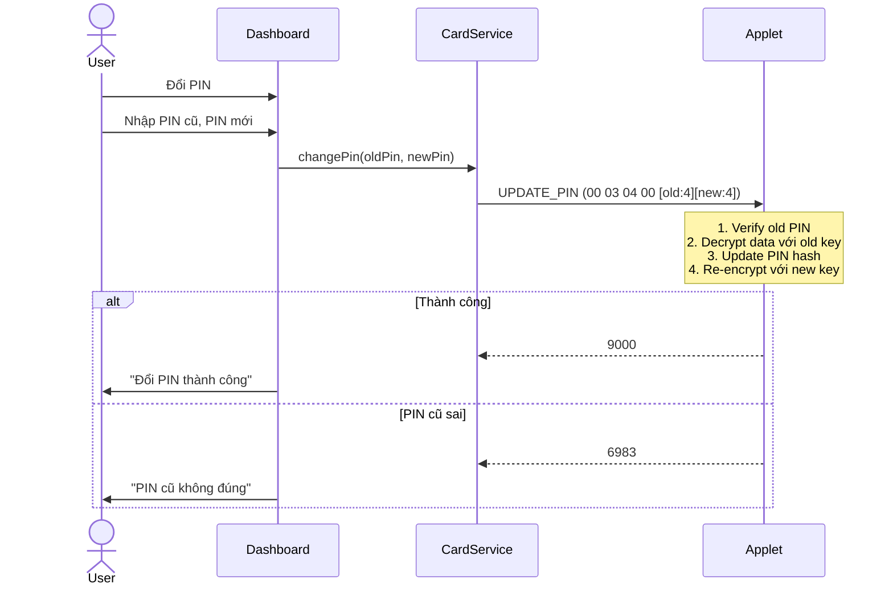

---

## 📊 Bảng Database Schema

```sql
-- Thẻ đăng ký (Chỉ lưu ID và Key)
CREATE TABLE registered_cards (
    id INTEGER PRIMARY KEY AUTO_INCREMENT,
    card_id TEXT UNIQUE NOT NULL,
    public_key TEXT NOT NULL,
    card_status TEXT DEFAULT 'ACTIVE',
    registered_at DATETIME,
    last_accessed DATETIME
);

-- Hóa đơn
CREATE TABLE invoices (
    id INTEGER PRIMARY KEY AUTO_INCREMENT,
    card_id TEXT NOT NULL,
    amount BIGINT NOT NULL,
    description TEXT,
    status TEXT DEFAULT 'PENDING', -- PENDING, PAID, CANCELLED
    created_at DATETIME
);

-- Yêu cầu nạp tiền
CREATE TABLE topup_requests (
    id INTEGER PRIMARY KEY AUTO_INCREMENT,
    card_id TEXT NOT NULL,
    amount BIGINT NOT NULL,
    status TEXT DEFAULT 'PENDING', -- PENDING, APPROVED, REJECTED, SYNCED
    created_at DATETIME,
    approved_at DATETIME
);

-- Log giao dịch
CREATE TABLE transaction_logs (
    id INTEGER PRIMARY KEY AUTO_INCREMENT,
    card_id TEXT NOT NULL,
    operation_type TEXT NOT NULL,
    timestamp DATETIME,
    success BOOLEAN,
    error_message TEXT
);
```

---

## 🔐 APDU Commands Reference

| INS | P1 | P2 | Chức năng | Data |
|-----|----|----|-----------|------|
| 00 | 04 | 00 | VERIFY_PIN | [4-byte PIN] |
| 01 | 04 | 00 | CREATE_INIT | [PIN:4][idLen:1][id:N] |
| 01 | 05 | 09 | CREATE_AVATAR | [totalLen:2][offset:2][data] |
| 01 | 06 | 00 | CREATE_SIGNATURE | [challenge data] |
| 02 | 00 | 0A | GET_CARD_ID | - |
| 02 | 00 | 0B | GET_PUBLIC_KEY | - |
| 02 | 00 | 0C | GET_BALANCE | - |
| 02 | 05 | 07 | GET_INFO | - |
| 02 | 05 | 09 | GET_AVATAR | - |
| 03 | 04 | 00 | UPDATE_PIN | [old:4][new:4] |
| 03 | 05 | 07 | UPDATE_INFO | [encrypted data] |
| 03 | 05 | 0C | UPDATE_BALANCE | [type:1][amount:4] |
| 03 | 0A | 00 | FORGET_PIN | [newPin:4] |
| 03 | 0B | 00 | ACTIVATE_CARD | - |
| 03 | 0C | 00 | DEACTIVATE_CARD | - |
| 10 | 00 | 00 | RESET_PIN_TRIES | - |
| 11 | 00 | 00 | CLEAR_CARD | - |

---

## 📁 Cấu trúc Project

```
citizen_card/
├── applet/
│   └── src/citizen_applet/
│       └── citizen_applet.java     # JavaCard Applet (866 lines)
├── desktop/
│   └── src/main/java/citizencard/
│       ├── MainApp.java            # Entry point
│       ├── controller/
│       │   ├── LoginViewController.java
│       │   ├── AdminDashboardController.java   # 1615 lines
│       │   ├── CitizenDashboardController.java # 1848 lines
│       │   └── DemoWorkflowController.java
│       ├── dao/
│       │   └── CardDAO.java        # 631 lines, H2 Database
│       ├── service/
│       │   └── CardService.java    # 1007 lines, APDU communication
│       └── util/
│           ├── RSAUtils.java       # RSA signature verification
│           ├── PinInputDialog.java # PIN dialog component
│           └── DataValidator.java
└── data/
    └── citizen_card.mv.db          # H2 Database file
```
